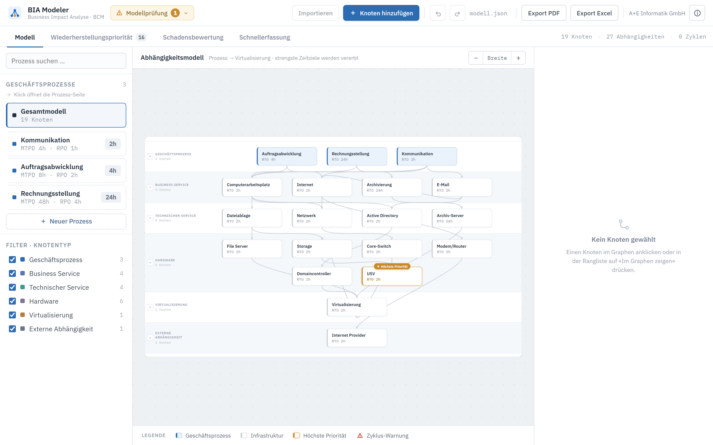
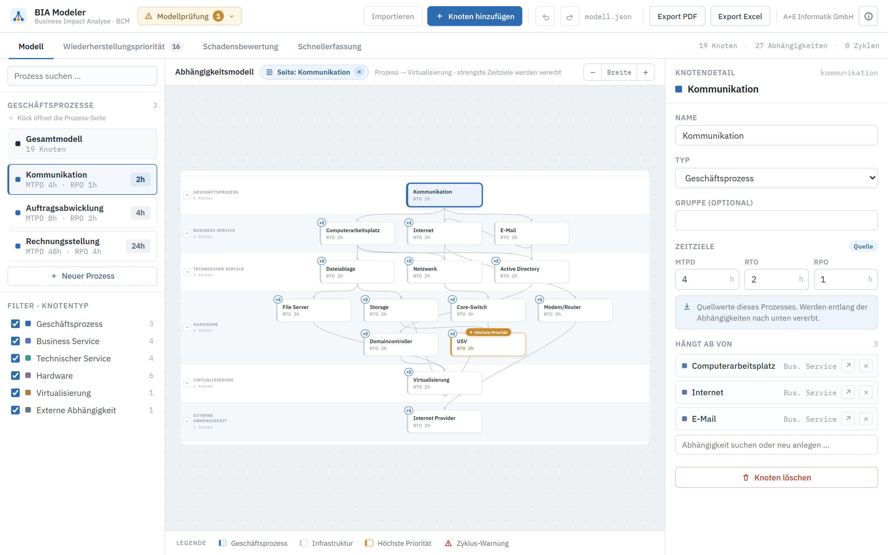

# BIA Modeler

Werkzeug für die **Business Impact Analyse (BIA)** im Business Continuity Management (BCM). Geschäftsprozesse und ihre technischen Abhängigkeiten werden als Modell erfasst. Daraus leitet das Tool ab, welche Systeme im Notfall in welcher Reihenfolge wiederhergestellt werden müssen.

> Entwickelt während meines Praktikums. Die Screenshots zeigen Beispieldaten.

## Was das Tool macht

- **Abhängigkeitsmodell:** Geschäftsprozesse, Business Services, technische Services, Hardware, Virtualisierung und externe Abhängigkeiten werden als Graph dargestellt. Die strengsten Zeitziele werden entlang der Abhängigkeiten nach unten vererbt.
- **Zeitziele:** Pro Prozess werden MTPD, RTO und RPO erfasst.
- **Wiederherstellungspriorität:** Die Reihenfolge der Komponenten wird automatisch berechnet, und zwar aus der strengsten geerbten RTO, der Anzahl abhängiger Prozesse und der Anzahl gestützter Komponenten.
- **Schadensbewertung:** Schadensszenarien werden je Prozess über mehrere Zeithorizonte bewertet (Unversehrtheit, Aufgabenerfüllung, Gesetze/Verträge, Aussenwirkung, Finanzen). Daraus entstehen MTPD und RTO, und die Herkunft ist nachvollziehbar.
- **Modellprüfung:** Warnungen bei Unstimmigkeiten und Erkennung von Zyklen in den Abhängigkeiten.
- **Import und Export:** Import des Modells, Export als PDF und Excel, Rückgängig/Wiederholen.

## Screenshots

### Gesamtmodell
Alle Prozesse und Abhängigkeiten auf einen Blick, gegliedert nach Ebenen. Die Komponente mit der höchsten Priorität ist markiert.

### Prozess-Ansicht
Nur die Abhängigkeiten eines einzelnen Prozesses, mit Detailbereich für Zeitziele und Abhängigkeiten.

### Wiederherstellungspriorität
Abgeleitete Rangliste der Komponenten für den Notfall.

### Schadensbewertung
Bewertungsmatrix je Geschäftsprozess, aus der MTPD und RTO hergeleitet werden.

